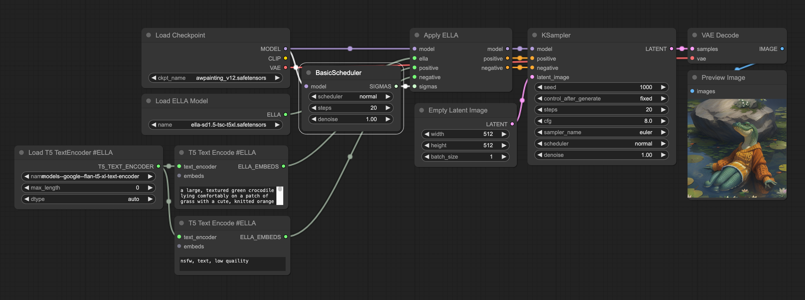
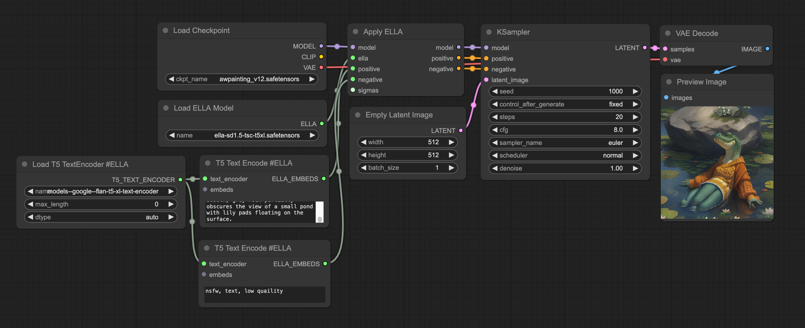
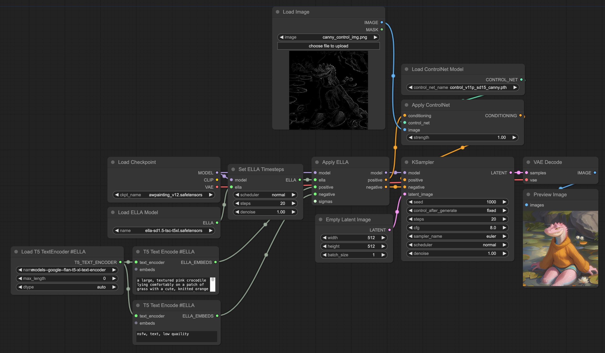
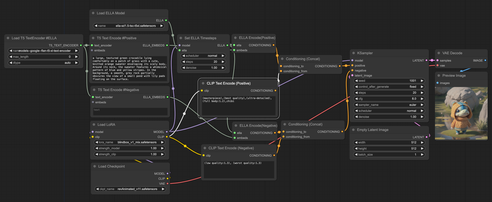
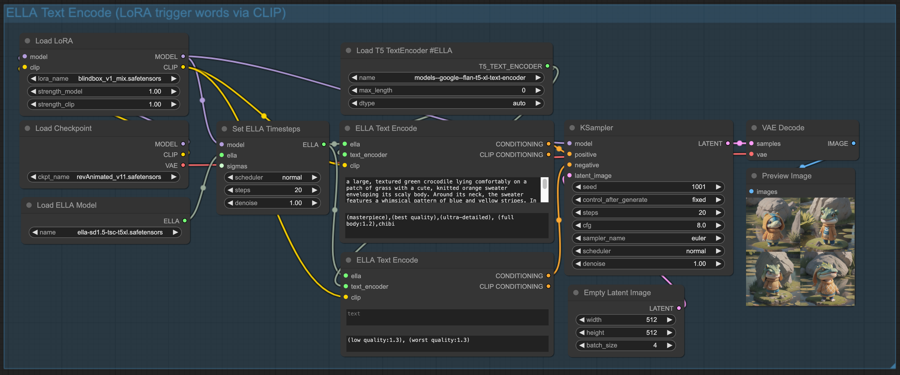
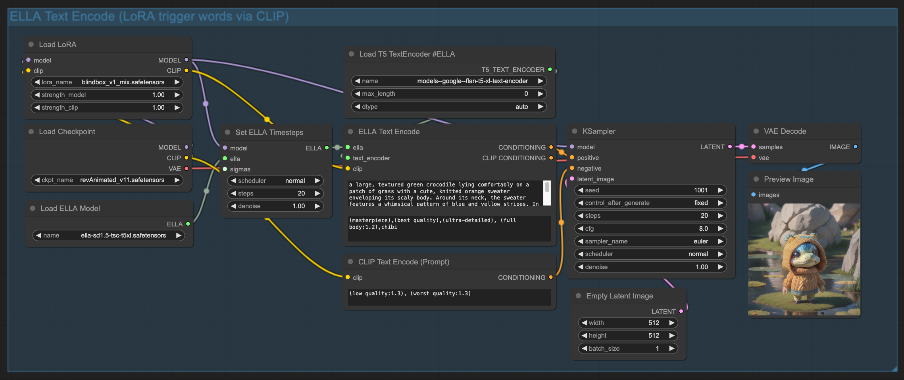
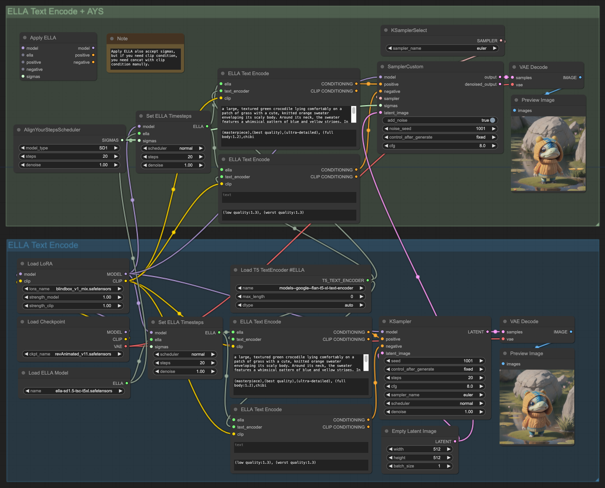

# ComfyUI-ELLA

<div align="center">
 <br/>
<a href='https://ella-diffusion.github.io/'></a>
<a href='https://arxiv.org/abs/2403.05135'></a>
</div>


[ComfyUI](https://github.com/comfyanonymous/ComfyUI)  implementation for [ELLA](https://github.com/TencentQQGYLab/ELLA).

## :star2: Changelog
- **[2024.4.30]** Add a new node `ELLA Text Encode` to automatically concat ella and clip condition.
- **[2024.4.24]** Upgraded ELLA Apply method. Better compatibility with the comfyui ecosystem. Refer to the method mentioned in [ComfyUI_ELLA PR #25](https://github.com/ExponentialML/ComfyUI_ELLA/pull/25)
  - **DEPRECATED**: `Apply ELLA` without `simgas` is deprecated and it will be removed in a future version.
- **[2024.4.22]** Fix unstable quality of image while multi-batch. Add CLIP concat (support lora trigger words now).
- **[2024.4.19]** Documenting nodes.
- **[2024.4.19]** Initial repo.

## :pushpin: Notice

- SIGMAS from node `BasicScheduler` or TIMESTEPS by node `Set ELLA Timesteps` must be the same as the KSampler settings. Because [Timestep-Aware Semantic Connector (TSC)](https://arxiv.org/html/2403.05135v1#S3), which dynamically adapts semantics features over sampling time steps, has been introduced.
- If you need concat clip `CONDITIONING` to make LoRA trigger words effective, ELLA output `CONDITIONING` **always** needs to be linked to the `conditioning_to` of `Conditioning (Concat)` node.

## :books: Example workflows

The [examples directory](./examples/) has workflow examples. You can directly load these images as workflow into ComfyUI for use.



All legacy workflows was compatible. But it is deprecated and will be removed in a future version.



:tada: It works with controlnet! 



:tada: It works with **lora trigger words** by concat CLIP CONDITIONING!

:warning: NOTE again that `ELLA CONDITIONING` always needs to be linked to the `conditioning_to` of `Conditioning (Concat)` node.



With `ELLA Text Encode` node, can simplify the workflow.



With the upgrade(2024.4.24), some interesting workflow can be implemented, such as using ELLA only in positive. As shown below:



| positive + negative | positive only |
| :---: | :---: |
|  |  |

However, there is no guarantee that positive-only will bring better results.

Workflow with [AYS](https://research.nvidia.com/labs/toronto-ai/AlignYourSteps/).



AYS got with more visual details and better text-alignment, ref to [paper](https://research.nvidia.com/labs/toronto-ai/AlignYourSteps/).

| w/ AYS | w/o AYS |
| :---: | :---: |
|  |  |

And [EMMA](https://github.com/TencentQQGYLab/ELLA/issues/15) is working in progress.

## :green_book: Install

Download or git clone this repository inside ComfyUI/custom_nodes/ directory. `ComfyUI-ELLA` requires the latest version of ComfyUI. If something doesn't work be sure to upgrade.

```bash
cd ComfyUI/custom_nodes
git clone https://github.com/TencentQQGYLab/ComfyUI-ELLA
```

Next install dependencies.

```bash
cd ComfyUI-ELLA
pip install -r requirements.txt
```

## :orange_book: Models

These models must be placed in the corresponding directories under models.

Remember you can also use any custom location setting an `ella` & `ella_encoder` entry in the `extra_model_paths.yaml` file.

- `ComfyUI/models/ella`, create it if not present.
  - Place [ELLA Models](https://huggingface.co/QQGYLab/ELLA) here
- `ComfyUI/models/ella_encoder`, create it if not present.
  - Place [FLAN-T5 XL Text Encoder](https://huggingface.co/QQGYLab/ELLA/tree/main/models--google--flan-t5-xl--text_encoder) here, it should be a folder of transfomers structure with config.json

In summary, you should have the following model directory structure:

```bash
ComfyUI/models/ella/
└── ella-sd1.5-tsc-t5xl.safetensors

ComfyUI/models/ella_encoder/
└── models--google--flan-t5-xl--text_encoder
    ├── config.json
    ├── model.safetensors
    ├── special_tokens_map.json
    ├── spiece.model
    ├── tokenizer_config.json
    └── tokenizer.json
```


## :book: Nodes reference

[Nodes reference](./NODES.md)

## :mag: Common promblem

- XXX not implemented for 'Half'. See [issue #12](https://github.com/TencentQQGYLab/ComfyUI-ELLA/issues/12#issuecomment-2067994702)
- AYS + Ella getting dark image generations. See [issue #39](https://github.com/TencentQQGYLab/ComfyUI-ELLA/issues/39#issuecomment-2097354330)
  - Check if `add_noise` of `SamplerCustom` node is enabled.
  - Lower the `cfg` of `SamplerCustom` node.

## :memo: TODO

- [ ] Support prompt weighting

## :hugs: Contributors (direct & indirect)

<table>
<tr>
   <td align="center"><a href="https://github.com/JettHu"><br /><sub><b>JettHu</b></sub></a></td>
   <td align="center"><a href="https://github.com/budui"><br /><sub><b>budui</b></sub></a></td>
   <td align="center"><a href="https://github.com/kijai"><br /><sub><b>kijai</b></sub></a></td>
   <td align="center"><a href="https://github.com/huagetai"><br /><sub><b>huagetai</b></sub></a></td>
</tr>
</table>

## :yum: Thanks

- ComfyUI: https://github.com/comfyanonymous/ComfyUI
- Diffusers (borrowed timestep modules): https://github.com/huggingface/diffusers

## :wink: Citation

```
@misc{hu2024ella,
      title={ELLA: Equip Diffusion Models with LLM for Enhanced Semantic Alignment}, 
      author={Xiwei Hu and Rui Wang and Yixiao Fang and Bin Fu and Pei Cheng and Gang Yu},
      year={2024},
      eprint={2403.05135},
      archivePrefix={arXiv},
      primaryClass={cs.CV}
}
```
